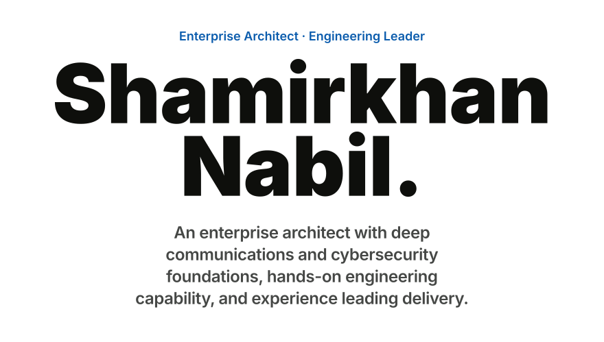
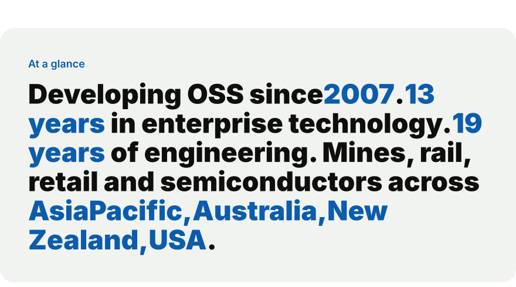
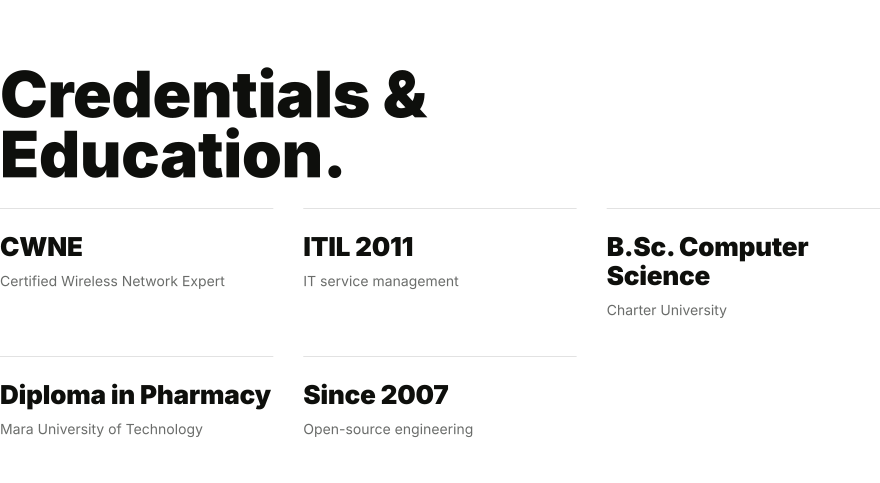

<!-- Generated by scripts/render.py from profile/content.json. Edit the content, not this file. -->

<picture>
  <source media="(max-width: 640px) and (prefers-color-scheme: dark)" srcset="assets/hero-dark-narrow.svg">
  <source media="(max-width: 640px)" srcset="assets/hero-light-narrow.svg">
  <source media="(prefers-color-scheme: dark)" srcset="assets/hero-dark-wide.svg">
  
</picture>

<picture>
  <source media="(max-width: 640px) and (prefers-color-scheme: dark)" srcset="https://raw.githubusercontent.com/fwnh67-20/fwnh67-20/activity/activity-dark-narrow.svg">
  <source media="(max-width: 640px)" srcset="https://raw.githubusercontent.com/fwnh67-20/fwnh67-20/activity/activity-light-narrow.svg">
  <source media="(prefers-color-scheme: dark)" srcset="https://raw.githubusercontent.com/fwnh67-20/fwnh67-20/activity/activity-dark-wide.svg">
  
</picture>

<picture>
  <source media="(max-width: 640px) and (prefers-color-scheme: dark)" srcset="assets/practice-light-narrow.svg">
  <source media="(max-width: 640px)" srcset="assets/practice-light-narrow.svg">
  <source media="(prefers-color-scheme: dark)" srcset="assets/practice-light-wide.svg">
  
</picture>

<picture>
  <source media="(max-width: 640px) and (prefers-color-scheme: dark)" srcset="assets/method-dark-narrow.svg">
  <source media="(max-width: 640px)" srcset="assets/method-light-narrow.svg">
  <source media="(prefers-color-scheme: dark)" srcset="assets/method-dark-wide.svg">
  
</picture>

<picture>
  <source media="(max-width: 640px) and (prefers-color-scheme: dark)" srcset="assets/expertise-dark-narrow.svg">
  <source media="(max-width: 640px)" srcset="assets/expertise-light-narrow.svg">
  <source media="(prefers-color-scheme: dark)" srcset="assets/expertise-dark-wide.svg">
  
</picture>

<picture>
  <source media="(max-width: 640px) and (prefers-color-scheme: dark)" srcset="assets/glance-dark-narrow.svg">
  <source media="(max-width: 640px)" srcset="assets/glance-light-narrow.svg">
  <source media="(prefers-color-scheme: dark)" srcset="assets/glance-dark-wide.svg">
  
</picture>

<picture>
  <source media="(max-width: 640px) and (prefers-color-scheme: dark)" srcset="assets/career-dark-narrow.svg">
  <source media="(max-width: 640px)" srcset="assets/career-light-narrow.svg">
  <source media="(prefers-color-scheme: dark)" srcset="assets/career-dark-wide.svg">
  
</picture>

<b>Role details</b>

#### Enterprise Architect · Australia
Mar 2026 – Present

- Collaborating with leadership and engineering teams to turn operational problems into solutions with clear architecture, a costed plan and a delivery path.
- Designing and architecting end-to-end tracking solutions, including solution blueprints, integration boundaries, transition plans, statements of work and effort estimates.
- Hands-on delivery, building and troubleshooting applications, platforms and cloud-to-edge systems.
- Recent work includes fleet tracking and energy monitoring platforms.

#### Engineering Manager · Asia Pacific, Australia & New Zealand
Oct 2023 – Mar 2026

- Managed engineers, technical priorities and customer escalations while balancing team delivery with stakeholder and management responsibilities.
- Provided end-to-end consulting across enterprise applications, AI, communications, mobility, RFID and automation.
- Stayed close to the work by taking part in engineering decisions and holding the team to a high standard of delivery quality.

#### Senior Systems Engineer · Asia Pacific, Australia & New Zealand
Oct 2016 – Oct 2023

- Provided consulting and escalation support on site for communications, mobility and industrial deployments.
- Connected customer requirements with firmware and network investigations to find the root cause.
- Supported Android Enterprise devices and applications from Jelly Bean through Oreo and later releases.
- Investigated operating system and firmware issues, device and network interoperability, and MDM problems with SOTI, 42Gears and Intune.
- Supported Workforce Connect enterprise VoIP and PBX integration and applied WiNG, MeshConnex and ADSP expertise in customer environments.
- Designed and supported mining communications for autonomous haulage (AHS) and manned fleets at major Western Australian iron ore operations.
- Also delivered RFID and automation advisory.

#### Technical Systems Engineer II · Asia Pacific, Australia & New Zealand
May 2015 – Oct 2016

- Grew coverage from Australia and New Zealand to the wider Asia Pacific region.
- Consulted on wired and wireless deployments and on WiNG 5, MeshConnex and ADSP interoperability with other networking vendors.
- Validated engineering builds, beta releases and new product introductions (NPI).
- Recreated customer networks in VeriWave and IxChariot test environments with regression scripting.
- Investigated firmware defects and performance issues together with engineering.
- Rebuilt internal and external WLAN knowledge sharing into reusable diagnostic guidance.

#### Technical Systems Engineer · Australia & New Zealand
Oct 2014 – May 2015

- Served as the WiNG and ADSP subject matter expert.
- Advised on WIPS operation, wireless threat detection and prevention, rogue device investigation and secure WLAN deployment.
- Used packet and network analysis to guide troubleshooting.
- Trained support and test engineering staff and led their technical development after the enterprise business changed hands.

#### Customer Operations Engineer · Australia & New Zealand
Feb 2014 – Oct 2014

- Managed communications, network cases and software investigations for Australia and New Zealand within Customer Response Engineering.
- Served as the MeshConnex subject matter expert for enterprise and public systems customers.
- Supported ASTRO, TETRA and DIMETRA, iDEN, WiMAX, WiNG, MOTOMESH and MeshConnex, and ADSP.
- Handled radio upgrades and troubleshooting for confidential government and mining customers, along with transitional Canopy and legacy handheld support.
- Joined the RFID reader development group and contributed to tag reading techniques and read reliability investigations.

#### Technical Support Engineer · Singapore & Malaysia
Feb 2013 – Feb 2014

- Supported small business and premium support customers across client systems, workstations, servers, storage and switching.
- Covered virtual machine infrastructure and provided dedicated firewall support.
- Owned diagnostic analysis, case records and engineering escalations.
- Provided on-site support for critical customers across compute, storage, networking and security.

#### Pharmacist · Malaysia
Nov 2011 – Jan 2013

- Delivered medication consultations for infectious disease, with guidance on drug use and mechanisms of action.
- Prepared extemporaneous medicines and managed inpatient and outpatient pharmacy operations and inventory.
- Reviewed clinical cases and drug utilisation statistics to find cost savings and operational efficiencies.

<picture>
  <source media="(max-width: 640px) and (prefers-color-scheme: dark)" srcset="assets/engagements-light-narrow.svg">
  <source media="(max-width: 640px)" srcset="assets/engagements-light-narrow.svg">
  <source media="(prefers-color-scheme: dark)" srcset="assets/engagements-light-wide.svg">
  
</picture>

<picture>
  <source media="(max-width: 640px) and (prefers-color-scheme: dark)" srcset="assets/credentials-dark-narrow.svg">
  <source media="(max-width: 640px)" srcset="assets/credentials-light-narrow.svg">
  <source media="(prefers-color-scheme: dark)" srcset="assets/credentials-dark-wide.svg">
  
</picture>

---

<a href="https://shamirkhannabil.com">shamirkhannabil.com</a> · <a href="mailto:nabil.shamir@innov8advisory.com.au">nabil.shamir@innov8advisory.com.au</a>

© Shamirkhan Nabil · Innov8 Advisory

